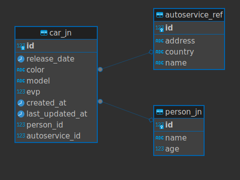
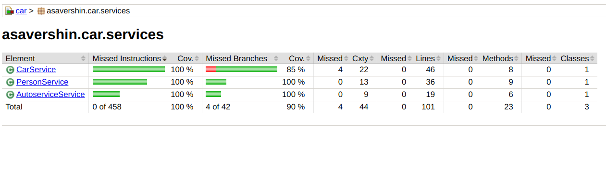

# Описание
Реестр машин, которые могут быть привязаны к   
определённому владельцу и автосервису

# Сборка проекта
./mvnw clean package -DskipTests
docker compose up
# Окружение
.properties основной файл окружения  
# Порты
Для приложения 8081  
Для базы данных 5440  
Чтобы поменять порты, нужно изменить их  
в файле .properties и в docker-compose.yml
# Структура БД

# Тесты
  
Для запуска тестов:  
./mvnw clean test

